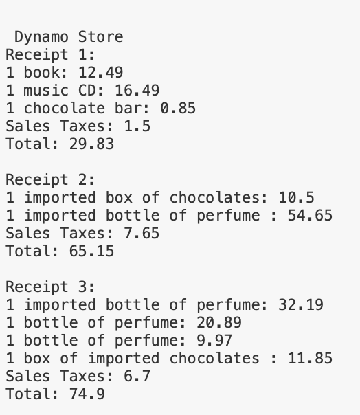

# Example .NET Microservice that calculates sales tax and prints receipts

## Problem: Sales Taxes
Basic sales tax is applicable at a rate of 10% on all goods, except books, food, and medical products that are exempt. Import duty is an additional sales tax applicable on all imported goods at a rate of 5%, with no exemptions. 
When I purchase items, I receive a receipt which lists the name of all the items and their price (including tax), finishing with the total cost of the items, and the total amounts of sales taxes paid. The rounding rules for sales tax are that for a tax rate of n%, a shelf price of p contains (np/100 rounded up to the nearest 0.05) amount of sales tax. 
Write an application that prints out the receipt details for these shopping baskets... 

## Solution


## To See Receipts on Console
```
dotnet run
```

## Techstack
- .NET Core
- C#
- Visual Studio Code
- xUnit

## Service
- Main class creates two Items in a Shopping Cart
- Calculate Sales Tax
- Detects exampt items
- Prints receipt with taxes

## Output
- Recipt
- Tax Calculation

## Ext Points
- Docker image
- Intercommunication of services to pass in data and information
- Except ids from a persistant store

## Tests
Example Run:
```
dotnet run
```
### Notes:
- using .NET naming conventions i.e., PascalCase